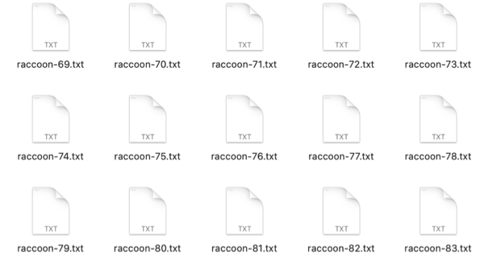
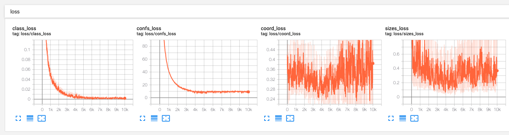
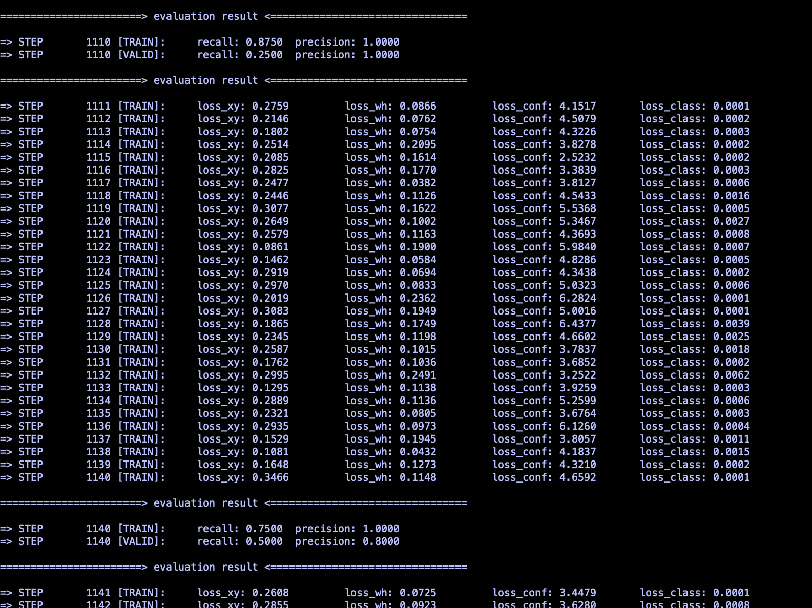

# 基于YOLOv3的目标检测模型
**1.**  **项目简述**

本项目主要面向华为Atlas 500进行开发！面向华为Atlas 500进行开发！面向华为Atlas 500进行开发！所以你会看到代码中很多奇怪的地方，比如为什么不用tensorflow提供的BN层，而需要自己实现一个BN层，诸如此类的，都是因为目前很多tensorflow的算子华为不支持！目前很多tensorflow的算子华为不支持！目前很多tensorflow的算子华为不支持！

所以如果你想要了解如何应用YOLOv3进行目标检测，可以看一下本项目的来源：

* https://github.com/opensourceai/yolov3-tensorflow-cn

当然，我也在该项目的基础上进行了简化，个人觉得整体的代码结构是更加清晰易懂的。

在了解本模型前，在理论方面，需对CNN等基础神经网络理论有一定了解，同时建议按顺序阅读YOLO系列三篇论文：

【1】  You Only Look Once: Unified, Real-Time Object Detection

【2】  YOLO9000: Better, Faster, Stronger

【3】  YOLOv3: An Incremental Improvement

在环境方面，需要安装:

1. tensorflow1.x版本（atlas 500不支持2.x版本）

2. Atlas 500 DDK，详情可参考《Atlas 500 DDK安装指南》

3. Mind Studio，详情可参考《Ascend 310 Mind Studio工具安装指南》。

DDK与Mind Studio的安装可能会遇到较多问题，建议观看华为提供的Atlas 200DK系列教程（[点击访问](https://www.huaweicloud.com/ascend/Institute)），按照视频指示安装。

**2.  代码说明**

**2.1 数据准备及预处理**

目标检测对图像的标注主要是标注边界框的信息，可以是边界框的左上角坐标和边界框的宽高长度，而本模型则标记边界框的左上角和右下角坐标，工具是BBox-Label-Tool，可在GitHub下载（[点击打开](https://github.com/puzzledqs/BBox-Label-Tool)）。

下载后，把需要标记的图像放在“image/001”，运行main.py，在image Dir输入1，点击load，即可显示图片，通过点击目标的左上角和右下角得到边界框坐标数据，点击下方的next，即可继续标注下一张图片，要注意的是，图片的后缀必须是JPEG。

标注完成后，在“labels/001”得到标注信息。

到这里就完成了图像数据的标注，项目中已经提供了一些已经处理好的数据文件。

接下来就是把标注的数据和原图像整合在一起，利用tensorflow进行处理。

标注完成后，可把图像存放在“data/images”，把标注文件放在“data/bbox”，然后运行readfile.py，得到我们需要的训练集和测试集。这里的目的是把图片在项目中的位置、边界框坐标、分类结果整合在一个txt文件里，从而让tensorflow做进一步的处理。

因为数据量较大，每次训练都直接读取的话效率就很低，所以tensorflow就提供了一种较为高效的数据读取方式tfrecord，可通过convert_tfrecord.py基于图像数据生成tfrecord，注意，这个代码需要运行两遍，第一次是生成trainset，第二次是生成testset，通过修改代码中的文件名实现。

到目前为止，我们就完成了数据的预处理，可通过运行“train/show_images_from_tfrecord.py”查看效果，如果看到图片已经包含了边界框、分类名，那就说明预处理成功。

**2.2 训练模型**

可直接运行“train/quick_train.py”训练模型，训练之前可修改部分参数，如shuffle_size、steps、训练集测试集的batch size等等。

**2.3 训练结果**

以下是用一张Nvidia T4对大小为400的训练集训练了10000次后的结果：

主要包括四个部分，第一个是分类的损失，第二个是置信度损失，第三个是边界框坐标损失，第四个是边界框宽高损失，可以看出，模型在分类方面做得不错，但是对于边界框回归就较差了，潜在的原因有几个。

第一，一般来说，YOLOv3往往会采用预训练的特征提取器Darknet进行特征提取，其他YOLO结构再针对实际的训练数据进行fine tuning，但是因为原来的Darknet结构包含部分华为不支持的算子，所以只能修改，修改之后就用不了预训练模型的参数文件了。

第二，训练数据过少，这也是一个很关键的因素。

但是不论怎么说，分类损失能降低，但是边界框回归损失降不下来，这都是一个值得探究的问题。

初次之外，再来看看模型的召回率（recall）和准确率（precision）：

这是训练过程中的截图，主要想说明的是，在训练后期训练集的召回率和准确率都可以接近1，而对于测试集的准确率也可以接近1，但召回率却变化很大，通俗来说，假如我们的测试集有20个样本，其中有10个样本包含目标，我们的模型有时候可以预测出其中的3个，有时候可预测出其中的8个，但是，它预测的目标80%以上都是准确的，很少会把不包含目标的样本预测成包含目标的样本。

从另一个角度来说，可以认为目前的模型特征提取能力较强，可是泛化能力较弱，增大数据量应该可以改善这个现象。

**3 针对Atlas500的离线模型转化**

虽然本质上这只是一个普通的YOLOv3目标检测模型，但我在该模型上花费的主要精力在于使其能转化成Atlas 500支持的离线模型格式，其中的难点在于如何用Atlas 500支持的算子改写模型。关于如何修改算子、如何把tensorflow模型转化成Atlas 500支持的离线模型格式，之后我会继续在博客补充详细说明。

