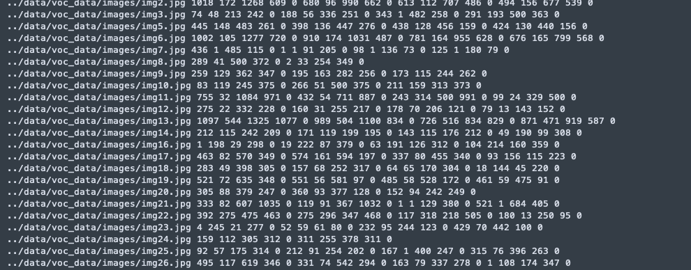
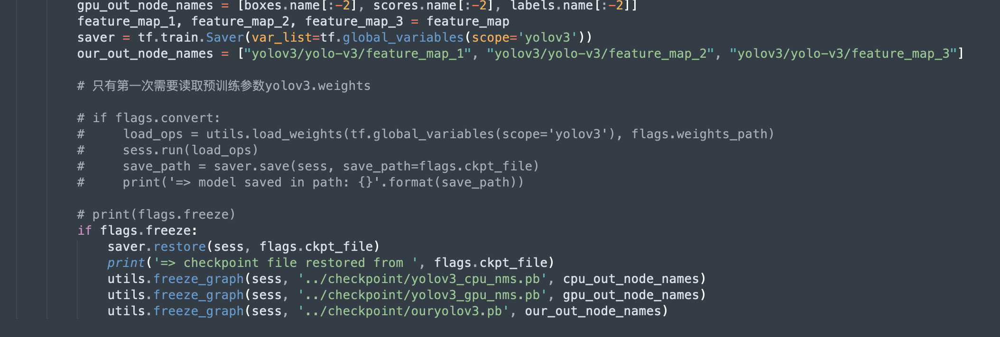

基于YOLOv3的目标检测模型

**1.**  **项目简述**

本项目主要面向华为Atlas 500进行开发，基于以下项目进行简化修改：

* https://github.com/opensourceai/yolov3-tensorflow-cn

在了解本模型前，在理论方面，需对CNN等基础神经网络理论有一定了解，同时建议按顺序阅读YOLO系列三篇论文：

【1】  You Only Look Once: Unified, Real-Time Object Detection

【2】  YOLO9000: Better, Faster, Stronger

【3】  YOLOv3: An Incremental Improvement

在环境方面，需要安装:

1. tensorflow1.x版本（atlas 500不支持2.x版本，**强烈建议使用tensorflow1.11，该版本对算子支持度最高，如果使用其他版本的tensorflow运行本项目在利用omg转化模型时会报错**）

2. Atlas 500 DDK，详情可参考《Atlas 500 DDK安装指南》

华为官方也有提供一些值得阅读参考的文档：

* 《api-matrix-atlas500app》

* 《Atlas 500 应用软件开发指南 01》

* 《Atlas 500 软件开发指导书 02》

* 《Atlas 500 模型转换指导 02》

* 《Atlas 500 用户指南 04》

* 《Atlas 500 算子清单 02》

* 《Atlas 智能边缘管理系统 用户指南 05》

* 《华为Atlas 500 智能小站 技术白皮书（型号 3000 3010）02》

 

**2.  代码说明**

**2.1 数据准备及预处理**

目标检测对图像的标注主要是标注边界框的信息，可以是边界框的左上角坐标和边界框的宽高长度，而本模型则标记边界框的左上角和右下角坐标，工具是BBox-Label-Tool，可在GitHub下载（[点击打开](https://github.com/puzzledqs/BBox-Label-Tool)）。

下载的时候需要注意，如果需要进行多目标的标注，需要在branch选择multi-class。

下载后，把需要标记的图像放在“image/001”，运行main.py，在image Dir输入1，点击load，即可显示图片，通过点击目标的左上角和右下角得到边界框坐标数据，点击下方的next，即可继续标注下一张图片，要注意的是，图片的后缀必须是JPEG。

标注完成后，在“labels/001”得到标注信息。

到这里就完成了图像数据的标注，项目中已经提供了少量VOC数据集。

接下来就是把标注的数据和原图像整合在一起，利用tensorflow进行处理。

标注完成后，可把图像存放在“data/voc_data/images”，把标注文件放在“data/voc_data/Annotations”(当然你也可以新建一个文件夹放你的数据，因为我这里用的是voc数据集所以才命名为voc_data)，然后运行data/voc_data/readXML.py，得到我们需要的训练集和测试集。这里的目的是把图片在项目中的位置、边界框坐标、分类结果整合在一个txt文件里，从而让tensorflow做进一步的处理。

因为数据量较大，每次训练都直接读取的话效率就很低，所以tensorflow就提供了一种较为高效的数据读取方式tfrecord，可通过train/convert_tfrecord.py基于图像数据生成tfrecord，注意，这个代码需要运行两遍，第一次是生成trainset，第二次是生成testset，通过修改代码中的文件名实现。

到目前为止，我们就完成了数据的预处理，可通过运行“train/show_images_from_tfrecord.py”查看效果，如果看到图片已经包含了边界框、分类名，那就说明预处理成功。

 

**2.2 训练模型**

在训练之前，还要检查一下train/quick_train.py、train/convert_weight.py中的类别数是否符合你的数据。

另一方面，因为我们其实是在yolov3的基础上做fine tuning，所以需要下载预训练模型，也就是yolov3.weights，可在https://github.com/opensourceai/yolov3-tensorflow-cn 找到。

可直接运行“train/quick_train.py”训练模型，训练之前可修改部分参数，如shuffle_size、steps、训练集测试集的batch size等等。

 

**2.3 训练结果**

以下是用一张Nvidia T4对大小为400的训练集训练了10000次后的结果：

主要包括四个部分，第一个是分类的损失，第二个是置信度损失，第三个是边界框坐标损失，第四个是边界框宽高损失，可以看出，模型在分类方面做得不错，但是对于边界框回归就较差了，潜在的原因有几个。

第一，一般来说，YOLOv3往往会采用预训练的特征提取器Darknet进行特征提取，其他YOLO结构再针对实际的训练数据进行fine tuning，但是因为原来的Darknet结构包含部分华为不支持的算子，所以只能修改，修改之后就用不了预训练模型的参数文件了。

第二，训练数据过少，这也是一个很关键的因素。

但是不论怎么说，分类损失能降低，但是边界框回归损失降不下来，这都是一个值得探究的问题。

初次之外，再来看看模型的召回率（recall）和准确率（precision）：

这是训练过程中的截图，主要想说明的是，在训练后期训练集的召回率和准确率都可以接近1，而对于测试集的准确率也可以接近1，但召回率却变化很大，通俗来说，假如我们的测试集有20个样本，其中有10个样本包含目标，我们的模型有时候可以预测出其中的3个，有时候可预测出其中的8个，但是，它预测的目标80%以上都是准确的，很少会把不包含目标的样本预测成包含目标的样本。

从另一个角度来说，可以认为目前的模型特征提取能力较强，可是泛化能力较弱，增大数据量应该可以改善这个现象。

 

**2.4 模型转化**

训练好模型，再次运行train/convert_weight.py，但这次要注意，需要注释掉读取yolov3.weights的代码，因为我们需要从已经训练好的ckpt文件中读取模型结构和参数，从而转化为pb格式：

这里保存了三个pb文件，前两个是原本有的，最后一个是我自定义输出节点的，这里简单说一下三者的区别，第一个cpu.pb是指推理的时候，GPU通过调用pb输出初步结果（边界框坐标、置信度、分类结果），但是不进行NMS删除重复的边界框，而是交给CPU实现，而gpu.pb则是指GPU把NMS的过程也一并计算了，至于我自己定义的our.pb，则是只需要GPU把feature map计算出来就好，后面所有的后处理都交给CPU计算。

具体选择在推理时让GPU和CPU分别计算什么内容，需要根据实际情况判断。

得到pb文件之后，我们就可以利用Atlas500DDK的omg工具转化为om格式的模型文件

 

**2.5 编译与运行**

得到了om文件之后，还需要基于华为的matrix框架，对模型进行编译和部署，编译可参考华为的Sample：

https://gitee.com/HuaweiAtlas/samples/tree/master/Samples/InferObjectDetection

最后附一个在Atlas500上运行时的画面

 

**3 学习笔记**

* [工业界的深度学习（一）：服务器训练环境的搭建](https://blog.csdn.net/jesseyule/article/details/104601282)
* [工业界的深度学习（二）：边缘场景的模型落地与Atlas 500](https://blog.csdn.net/jesseyule/article/details/104683695)
* [工业界的深度学习（三）：针对华为Atlas 500的模型转换及tensorflow算子修改心得](https://blog.csdn.net/jesseyule/article/details/104931677)
* [工业界的深度学习（四）：tensorflow架构及针对Atlas500的算子修改](https://blog.csdn.net/jesseyule/article/details/106149346)

